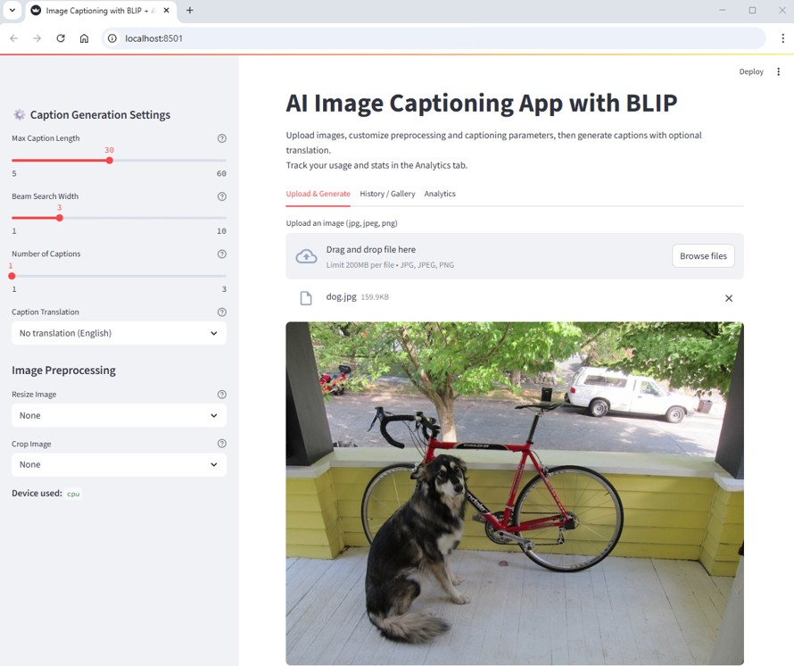
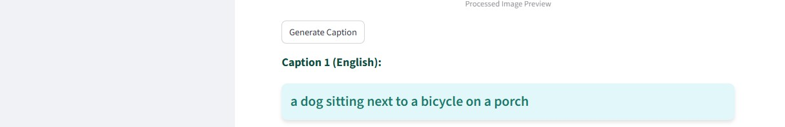
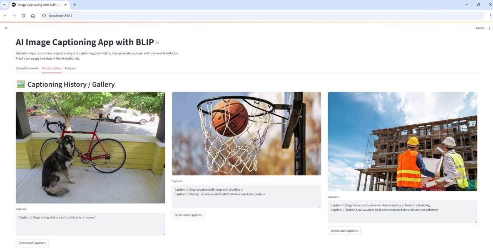

# 🖼️ Image Captioning with BLIP

[](https://streamlit.io/)
[](https://huggingface.co/Salesforce/blip-image-captioning-base)
[](https://www.python.org/)
[](LICENSE)

> A complete project that demonstrates **automatic image captioning** using the [BLIP model](https://huggingface.co/Salesforce/blip-image-captioning-base).  
> Includes:
> - 📱 **Streamlit Web App** for easy image upload and caption generation
> - 📓 **Step-by-Step Jupyter Notebook** for experimentation
> - 📂 **Image Dataset** for testing and extending the model

---

## 📌 Project Overview

**Image Captioning** is the task of **generating descriptive text for images**.  
This project uses **BLIP** (Bootstrapping Language-Image Pre-training), a vision-language model capable of understanding visual content and generating natural language descriptions.

We provide:
- A **Streamlit app** for interactive caption generation
- A **Jupyter Notebook** for in-depth understanding
- A **sample dataset** for quick testing

---

## 🚀 Features

✅ Upload an image and get an instant caption  
✅ Switch between **beam search** (accurate) and **sampling** (creative) generation  
✅ Support for **batch captioning** in the notebook  
✅ GPU acceleration when available  
✅ Clean, user-friendly UI with copy-to-clipboard  
✅ Detailed help tooltips in settings  
✅ Image caption history in the Streamlit app

---

## 📸 Screenshots

### Streamlit Web App




---

## 🛠 Installation

### 1️⃣ Clone the Repository

```bash
git clone https://github.com/antoningr/Image_to_Text_Captioning
cd Image_to_Text_Captioning
```

### 2️⃣ Create a Virtual Environment (optional)

```bash
python -m venv venv
source venv/bin/activate   # On Linux/Mac
venv\Scripts\activate      # On Windows
```

### 3️⃣ Install Requirements

```bash
pip install -r requirements.txt
```

---

## ▶️ Usage

### Run the Streamlit App

```bash
streamlit run app.py
```

Then open your browser at: http://localhost:8501


### Run the Jupyter Notebook

```bash
jupyter notebook notebook/image_captioning_blip.ipynb
```

---

## 🧠 How It Works

1. Model: BLIP from Hugging Face Transformers
2. Processor: Preprocesses the input image for the model
3. Caption Generation: Uses beam search (precise) or sampling (creative) decoding
4. Output: A descriptive text string generated from the image

Pipeline:

```bash
Image → Processor → BLIP Model → Decoder → Caption
```

---

## 📊 Example Results

| Image                      | Generated Caption                                           |
| -------------------------- | ----------------------------------------------------------- |
| 🐶 Dog                     | "a dog sitting next to a bicycle on a porch"                |
| 🏀 Basketball              | "a basketball hoop with a ball in it"                       |
| 👷 Construction Workers    | "two construction workers standing in front of a building"  |
